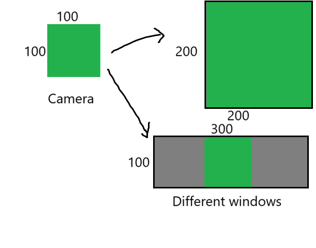

# BEVY_AUTO_SCALING

A very simple plugin for bevy to let graphics auto scale and center with the window.

For `Camera2d`, it can set logical display resolution of cameras, and sketch them to fit the window.

For `Camera3d`, it can set the width-height ratio of cameras, and sketch them to fit the window.

However, UI is uninfluenced.

# Usage

To auto-scale a camera, first, you need to add the corresponding plugin. For `Camera2d`, it is `Scale2dPlugin`; for `Camera3d`, it is `Scale3dPlugin`.

Then, you need to add `FixedSize` component to the camera entity. It have two properties: `width` and `height`. For `Camera2d`, they are the logical resolution. But for `Camera3d`, only the ratio between them matters.
